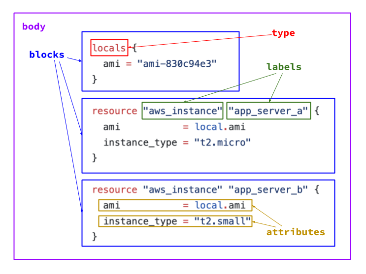

# tq


---

<p align="center">

</p>

<p align="center">
jq for .tf files (Terraform/OpenTofu)
</p>

---

## Install

```
go install github.com/jdolitsky/tq
```

_Note: requires `jq` (shells out to it under the hood)_

## Usage

If the queried object is able to be parsed as a .tf file, it
will be returned as such. If not, output will fall back to the JSON representation.

For the .tf files in the usage examples, please refer to the
[examples](./examples/) directory.

### Example: Extract values

```sh
tq '.body.blocks[] | select(.type == "locals").attributes.ami' examples/aws.tf
```

Output:

```
"ami-830c94e3"
```

### Example: Overwrite arguments for multiple resources

```sh
tq '.body.blocks[] |= if (
  .type == "resource" and
  .labels[0] == "aws_instance"
) then (
  .attributes.instance_type = "\"t2.medium\""
) else . end' examples/aws.tf
```

Output:

```hcl
locals {
  ami = "ami-830c94e3"
}

resource "aws_instance" "app_server_a" {
  ami           = local.ami
  instance_type = "t2.medium"
}

resource "aws_instance" "app_server_b" {
  ami           = local.ami
  instance_type = "t2.medium"
}

```

### Example: Delete resources

```sh
tq 'del(.body.blocks[] | select(
  .type != "resource" or
  .labels[0] != "aws_instance" or
  .labels[1] != "app_server_a"
))' examples/aws.tf
```

Output:

```hcl
resource "aws_instance" "app_server_a" {
  ami           = local.ami
  instance_type = "t2.micro"
}
```

### Example: Add a resource

```sh
tq '.body.blocks += [{
  type: "resource",
  labels: [
    "aws_instance",
    "app_server_c"
  ],
  attributes: {
    ami: "local.ami",
    instance_type: "\"t2.large\"",
  }
}]' examples/aws.tf
```

Output:

```hcl
locals {
  ami = "ami-830c94e3"
}

resource "aws_instance" "app_server_a" {
  ami           = local.ami
  instance_type = "t2.micro"
}

resource "aws_instance" "app_server_b" {
  ami           = local.ami
  instance_type = "t2.small"
}

resource "aws_instance" "app_server_c" {
  ami           = local.ami
  instance_type = "t2.large"
}

```

## Serialization Format

This repo also provides 2 extra tools, `tf2json` and `json2tf` which can be used to convert between .tf and JSON.
You can use the following command to install them:

```
go install github.com/jdolitsky/tq/extras/{tf2json,json2tf}
```

Using `tf2json` (and `jq`), you can inspect the schema of the serialialization format used by `tq`:

```
tf2json examples/aws.tf | jq
```

Output:

```json
{
  "body": {
    "blocks": [
      {
        "type": "locals",
        "labels": [],
        "attributes": {
          "ami": "\"ami-830c94e3\""
        },
        "body": {
          "blocks": []
        }
      },
      {
        "type": "resource",
        "labels": [
          "aws_instance",
          "app_server_a"
        ],
        "attributes": {
          "ami": "local.ami",
          "instance_type": "\"t2.micro\""
        },
        "body": {
          "blocks": []
        }
      },
      {
        "type": "resource",
        "labels": [
          "aws_instance",
          "app_server_b"
        ],
        "attributes": {
          "ami": "local.ami",
          "instance_type": "\"t2.small\""
        },
        "body": {
          "blocks": []
        }
      }
    ]
  }
}
```

The following diagram attempts to clarify the data structure:


</p>

The reason this format was chosen is to map as closely as possible to
the concepts found in the [`github.com/hashicorp/hcl/v2/hclwrite`](https://pkg.go.dev/github.com/hashicorp/hcl/v2/hclwrite)
Go library which is used to parse and generate .tf.

## Caveats

- There is not currently support for comments, meaning any comments on the original input are removed from the resulting HCL output
- In order to maintain deterministic output, all attributes (module arguments etc.) are alphabetically sorted, which may result in unexpected diffs
- All attribute values are strings (the `attributes` field is a `map[string]string`). This is required  due to how the underlying libraries are used. For this purpose, real strings must be double quoted (e.g. `"\"t2.micro\""`) and non-strings (of any type) should be single quoted (e.g. `"local.ami"`)
- In order to provide total parity `jq` functionality, `tq` just shells out to `jq`. We could have probably somehow imported [`gojq`](https://github.com/itchyny/gojq), but did not want to sacrifice functionality for the sake of having a standalone binary when most development environments contain `jq` anyway
- This project is called `tq` for a reason - it is designed for use with Terraform/OpenTofu files. This is not guaranteed to work with general-purpose HCL files, since Terraform-specific Go libraries are being used under the hood.

## Using as a Go Library

### Example: Build a Terraform file from scratch

Source: [`examples/tf-from-scratch/main.go`](./examples/tf-from-scratch/main.go)

```go
package main

import (
	"fmt"

	"github.com/jdolitsky/tq/pkg/tq"
)

func main() {
	// Equivalent of:
	//
	// resource "aws_instance" "app_server_a" {
	//   ami           = local.ami
	//   instance_type = "t2.micro"
	// }
	//
	tfFile := tq.TerraformFile{
		Body: tq.TerraformFileBody{
			Blocks: []tq.TerraformFileBlock{
				{
					Type: "resource",
					Labels: []string{
						"aws_instance",
						"app_server_a",
					},
					Attributes: map[string]string{
						"ami":           "local.ami",
						"instance_type": `"t2.micro"`,
					},
				},
			},
		},
	}

	// Convert to the hashicorp/hcl data type
	file := tq.Deserialize(&tfFile)

	// Pretty-print the Terraform
	fmt.Println(file)
}
```

### Example: Modify an existing Terraform file

Source: [`examples/tf-modify/main.go`](./examples/tf-modify/main.go)

```go
package main

import (
	"fmt"
	"log"
	"os"

	"github.com/jdolitsky/tq/pkg/tq"
)

func main() {
	tfb, err := os.ReadFile("./examples/aws.tf")
	if err != nil {
		log.Fatal(err)
	}

	tfFile, err := tq.ParseTerraform(tfb)
	if err != nil {
		log.Fatal(err)
	}

	// For all "aws_instance" resources,
	// modify the instance_type to "t2.large"
	for _, block := range tfFile.Body.Blocks {
		if block.Type == "resource" {
			if len(block.Labels) > 0 && block.Labels[0] == "aws_instance" {
				block.Attributes["instance_type"] = `"t2.large"`
			}
		}
	}

	// Convert back to Terraform
	file := tq.Deserialize(tfFile)

	// Pretty-print the Terraform
	fmt.Println(file)
}
```

## Alternatives

This project was only created since there did not appear to be
a reliable way to convert bidirectionally between Terraform to JSON.

The following alternatives were considered prior to `tq` being made:

- [`hcldec`](https://github.com/hashicorp/hcl/tree/main/cmd/hcldec): This is extremely powerful as it is closely tied into the rest of the Terraform codebase. However, it relies on a pre-existing spec file. This does not work if you want to operate dynamically on any .tf file. You can only also only convert in one direction using the CLI (Go libraries can be used to convert from JSON to Terraform if you have a spec file)
- [`hcl2json`](https://github.com/tmccombs/hcl2json): This is a third-party tool which will convert any HCL file to JSON. The JSON format is nice and readable (and could be easily piped into `jq`), but it does not provide any way to reliably convert the JSON back to .tf
